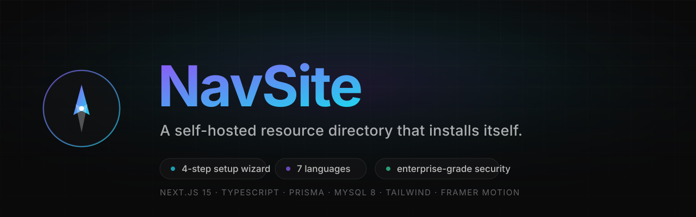
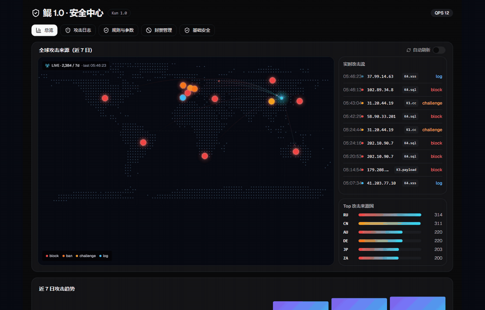
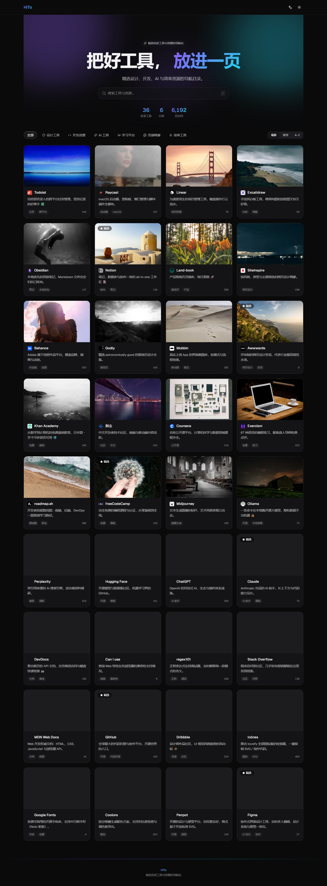
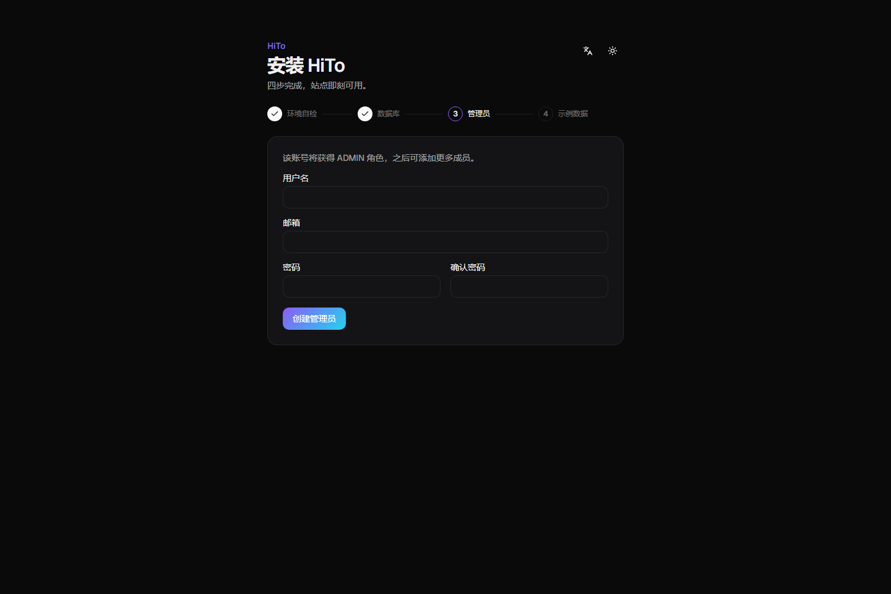
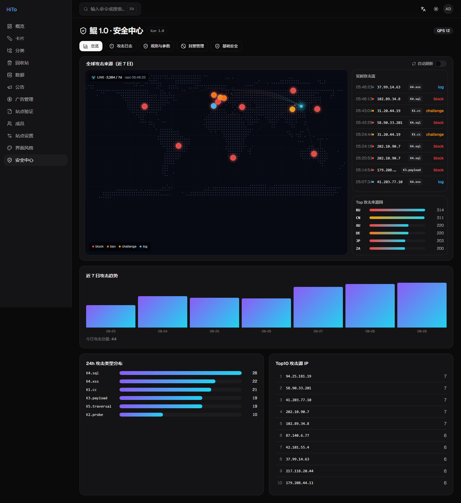
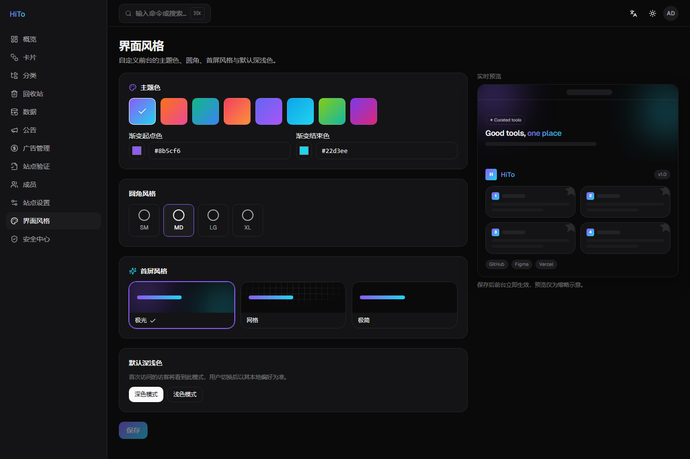
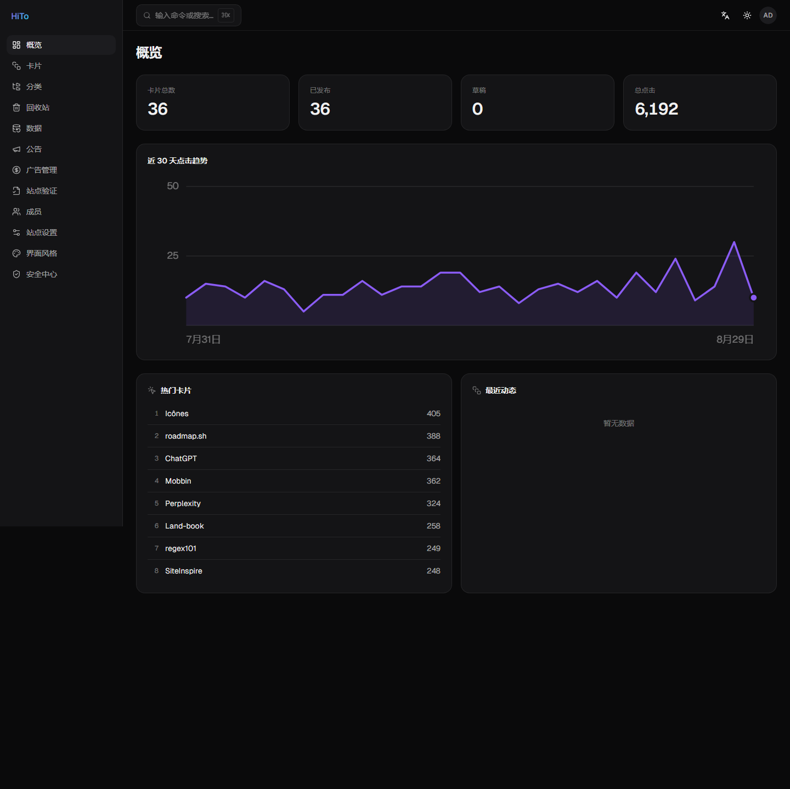
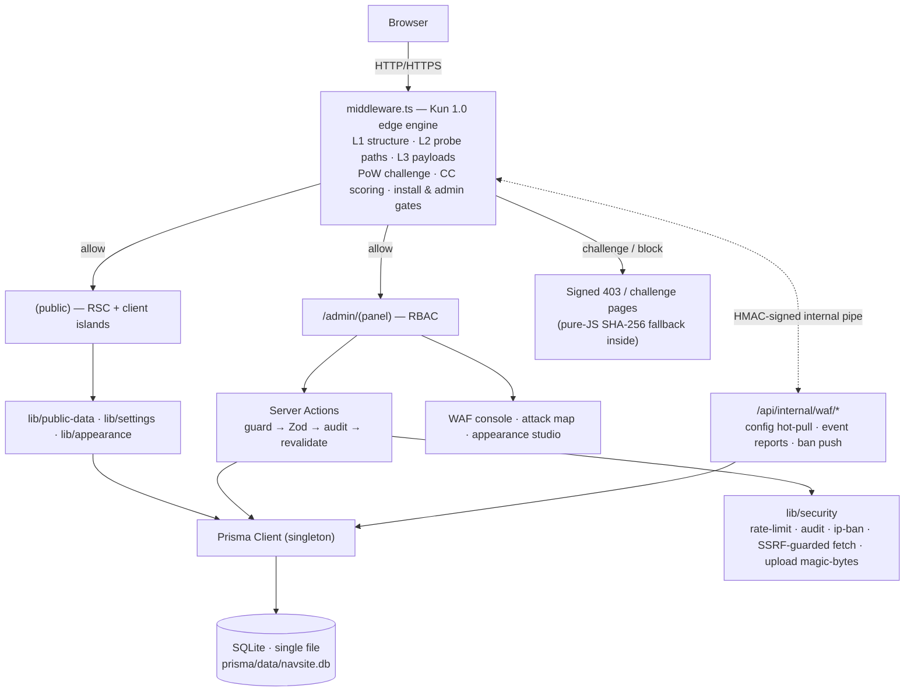

<p align="center">
  
</p>

<p align="center">
  <a href="#"></a>
  <a href="./LICENSE"></a>
  <a href="./package.json"></a>
  <a href="#14-contributing"></a>
  
  
  
</p>

<p align="center">
  <b>English</b> · <a href="./README.zh-CN.md">简体中文</a>
</p>

<p align="center">
  <a href="./docs/screenshots/demo.gif"></a>
</p>
<p align="center">
  <sub><b>Kun 1.0 edge WAF</b> — live dot-matrix attack map with real-time arcs · <b>iOS-style liquid-glass</b> category pills (true refraction on Chromium)</sub>
</p>

> **HiTo** is a self-hosted tool & resource directory: a polished public front-end + a full admin back-office + a first-run install wizard + **a real edge WAF with a live global attack map**. **A fresh clone goes live without editing a single line of code** — SQLite is built in, so there is no database server to install: the first visit lands on a four-step wizard, you create an admin, and you're live. Think a self-hosted, data-you-own alternative to Linktree / start-page directories — with the security engine most projects promise in a README actually running in `middleware.ts`.

---

<p align="center">
  <a href="./docs/screenshots/liquid-glass.gif"></a>
</p>
<p align="center">
  <sub><b>Liquid-glass pills</b> — back-and-forth switching at native speed (spring flight captured frame-by-frame)</sub>
</p>

## 📖 Table of Contents

- [1. What is this](#1-what-is-this)
- [2. Features](#2-features)
- [3. Screenshots](#3-screenshots)
- [4. Tech Stack](#4-tech-stack)
- [5. Architecture](#5-architecture)
- [6. Quick Start (3 commands)](#6-quick-start-3-commands)
- [7. Detailed Install Guide](#7-detailed-install-guide)
  - [7.1 Requirements](#71-requirements)
  - [7.2 Prepare the database — there is nothing to prepare](#72-prepare-the-database--there-is-nothing-to-prepare)
  - [7.3 Install dependencies and start](#73-install-dependencies-and-start)
  - [7.4 Complete the install wizard (four steps)](#74-complete-the-install-wizard-four-steps)
  - [7.5 Production deployment](#75-production-deployment)
  - [7.6 Restricted-egress / mirror setup](#76-restricted-egress--mirror-setup)
- [8. Environment Variables](#8-environment-variables)
- [9. Troubleshooting & Pitfalls](#9-troubleshooting--pitfalls)
- [10. Project Structure](#10-project-structure)
- [11. Scripts](#11-scripts)
- [12. Production Security Checklist](#12-production-security-checklist)
- [13. Roadmap](#13-roadmap)
- [14. Contributing](#14-contributing)
- [15. License](#15-license)
- [Changelog](#-changelog)

---

## 1. What is this

**HiTo** turns a scattered pile of links, tools, and resources into a **searchable, categorized, measurable** public directory, and ships a full back-office to maintain it.

What fundamentally sets it apart from similar tools:

- **Zero external dependencies.** The database is a single SQLite file managed by the app itself — no MySQL container, no managed RDS, no connection strings to hand-craft. Backing up your entire site means copying **one file**.
- **Deployment requires no code changes.** First visit lands on `/setup`: environment check, database probe + migrations, create an admin, optionally import sample data — four clicks and you're live. `.env` is written for you.
- **The security engine is real, not a bullet point.** **Kun 1.0** runs in the edge middleware on every request: structure validation, probe-path and payload scanning (SQLi / XSS / traversal / double-encoding), PoW browser attestation during attacks, per-IP scoring and escalating bans, HMAC-signed internal telemetry — and the admin panel renders it all as a **live dot-matrix world attack map with animated attack arcs**.
- **The look is yours too.** The admin Appearance studio changes the public site's accent colors, corner radius, hero style and default theme — with a live preview — and the whole front-end re-themes instantly. No CSS editing.

### Who it's for

- Developers building an internal tool directory, bookmark wall, or resource portal for a team/organization;
- Anyone wanting a personal directory that is "more controllable than Linktree, more professional than a Notion public page";
- Anyone wanting a self-hosted project that works out of the box yet can be safely handed to non-technical colleagues for day-to-day upkeep — **and survive the public internet**.

### What it solves

| Pain point | How HiTo handles it |
|---|---|
| Self-hosted deploys need a database server, manual file edits, migrations | SQLite is built in; first visit lands on a four-step wizard |
| WAF/Cloudflare costs money or isn't available | Kun edge WAF runs in-process: probe/payload scanning, PoW challenge, rate-limit bans |
| You can't see what's attacking you | Live global attack map, real-time attack feed, country ranking — in the admin panel |
| Data held hostage by a SaaS | One SQLite file you own; JSON/CSV export + snapshot backups built in |
| Content upkeep requires technical skills | Visual CRUD + drag-and-drop + bulk actions + ⌘K command palette |
| Re-theming means editing CSS | Appearance studio: colors / radius / hero style with live preview |

---

## 2. Features

- 🧭 **Public front-end** — aurora hero with animated gradient blobs (or grid / minimal, admin-selectable), glass search bar with a `/` focus shortcut, live stats strip, liquid-glass category pills (real refraction on Chromium, faithful fallback on Safari/Firefox — three rendering tiers), live search (300 ms debounce + keyword highlight), responsive card grid (1→5 columns), detail modal with focus trap, latest / featured / A–Z sorting, click analytics, copy link, footer social icons (X / Instagram / GitHub / WeChat / Weibo / Bilibili and more), announcement banner (4 tones, schedulable, dismissible), SEO output (sitemap.xml / robots.txt / JSON-LD), and full `prefers-reduced-motion` support.
- 🪄 **First-run install wizard** — a four-step state machine (environment check → database → admin → sample data) that writes `.env`, runs migrations and creates the first admin. **No manual file editing, no seed scripts to run by hand.** Resumable if interrupted; permanently locked after completion.
- 🛡️ **Kun 1.0 edge security engine** — every request passes through `middleware.ts`:
  - **L1** structure validation (method allow-list, URL length, control chars)
  - **L2** probe-path detection (`/.env`, `/.git`, `/wp-admin`, `/phpmyadmin`, backup dumps… each rule individually toggleable)
  - **L3** payload scanning for SQLi / XSS / path traversal — against the **raw, single-decoded and double-decoded** forms of every URL
  - **PoW challenge** — when QPS spikes or you flip "under-attack mode", browsers must solve a SHA-256 proof-of-work before entering (with a pure-JS hash fallback, so plain-HTTP LAN deployments work too); passing issues a signed, TTL-bound token
  - **CC protection** — per-IP sliding windows with escalating strike-based temporary bans, pushable to the admin panel live
  - **Global attack map** — Natural-Earth-accurate dot-matrix world, animated attack arcs from origin to your server, action-colored severity, live event feed, country ranking, auto-refresh
  - Engine modes `off / log / block` hot-swappable from the panel (≤10 s), plus a manual "under attack" button
- 🛠️ **Admin back-office** — dashboard with a 30-day click trend (**hand-rendered SVG, no chart library**), category & card CRUD, drag-and-drop ordering, bulk actions, one-click URL metadata scraping, dead-link checker, restorable trash, JSON/CSV import (dry-run preview) & export, snapshot backups, import from URL / cloud-drive direct links, multi-admin RBAC (ADMIN / EDITOR), announcement management (scheduling / priority / inline toggle), site settings with an SEO tab (title template / robots.txt editor / noindex / webmaster verifications), and a **⌘K command palette** (global search + pinyin aliases + recent items, lazy-loaded).
- 🎨 **Appearance studio** — 8 curated accent palettes + custom color pickers, four corner-radius presets, three hero styles, default light/dark for first-time visitors, all with a live miniature preview; saved values are injected as CSS variables (zod-validated, injection-proof) and the public site re-themes on the next request.
- 💰 **Ads & verification** — ad slots (header / footer / inline / sidebar / popup), four ad types (script / HTML / image / iframe), weight & device targeting, `ads.txt` served from the DB, and per-provider ownership verification (meta tag / verification file / DNS note).
- 🌍 **7 languages** — 简体中文 / English / 日本語 / 한국어 / Español / Français / Deutsch, negotiated **server-side** from `Accept-Language` (no flash). Zero hardcoded copy.
- 🧱 **Type-safe end to end** — TypeScript `strict` + `noUncheckedIndexedAccess`, `no-explicit-any` promoted to error, zero-warning lint budget.

---

## 3. Screenshots

| Home | Install wizard | WAF console · attack map |
|:---:|:---:|:---:|
|  |  |  |

| Appearance studio | Admin dashboard |
|:---:|:---:|
|  |  |

<p align="center"><sub>All screenshots were taken from a real running instance (demo data). Capture your own into <code>docs/screenshots/</code>.</sub></p>

---

## 4. Tech Stack

| Layer | Choice | Version |
|---|---|---|
| Framework | Next.js (App Router, RSC + Server Actions, edge middleware) | 15.3.3 |
| Language | TypeScript (`strict`, `noUncheckedIndexedAccess`) | 5.8.3 |
| UI runtime | React / React DOM | 19.1.0 |
| Styling | Tailwind CSS + tailwindcss-animate | 3.4.17 |
| Components | Radix UI (13 packages) + shadcn patterns | — |
| Motion | Framer Motion | 11.15.0 |
| i18n | next-intl | 3.26.3 |
| ORM | Prisma + @prisma/client | 6.8.2 |
| Database | SQLite (single file, `connection_limit=1` single-writer) | built-in |
| Validation / forms | Zod + react-hook-form | 3.24.1 / 7.54.2 |
| Auth | jose (JWT) + bcryptjs | 5.9.6 / 2.4.3 |
| DnD / palette / caches | @hello-pangea/dnd / cmdk / lru-cache | 18.0.1 / 1.0.4 / 11.0.2 |
| Runtime | Node ≥ 20.9, pnpm 9.15.4 | — |

---

## 5. Architecture



**One request, end to end:** `i18n/request.ts` negotiates the locale server-side from `Accept-Language` (no flash) → the Kun engine in `middleware.ts` inspects the request (a valid challenge token skips all scanning) → the install gate self-checks via a loopback call, and `/admin` gets a cookie pre-check → the page renders as an RSC, pulling data through the Prisma singleton (the front-end only ever sees `published`, non-deleted rows) → appearance settings arrive as CSS variables injected in `<head>` with the CSP nonce → any mutation goes through a Server Action: guard + rate-limit → Zod validation → audit log → `revalidatePath`. When the engine blocks or challenges, it also reports the event (HMAC-signed, throttled) into the `waf_events` table that feeds the attack map — and the real auth verdict lives on the database `Session` row, so **force-logout takes effect instantly**.

---

## 6. Quick Start (3 commands)

> Requirements: **Node ≥ 20.9** and **pnpm 9**. No database server — SQLite ships inside the app.

```bash
pnpm install               # postinstall runs prisma generate
pnpm dev                   # start, then open http://localhost:3000
```

Open <http://localhost:3000> — you are redirected to `/setup`. Complete the four-step wizard (the defaults already point at the built-in SQLite file), optionally import the sample data, and the site is live. **No files to edit, nothing else to install.**

For production in one line (builds a self-contained image with an nginx edge and healthchecks):

```bash
AUTH_SECRET=$(openssl rand -base64 48) ANALYTICS_SALT=$(openssl rand -base64 16) \
PUBLIC_URL=http://your-server-ip docker compose -f docker-compose.prod.yml up -d
```

---

## 7. Detailed Install Guide

> Every step below ends with a **✅ Verify** box — confirm it passes before moving to the next step.

### 7.1 Requirements

| Tool | Version | Check command |
|---|---|---|
| Node.js | ≥ 20.9 (20 / 22 LTS recommended) | `node -v` |
| pnpm | 9.15.4 | `pnpm -v` |

If pnpm isn't installed yet:

```bash
# Option 1: corepack (ships with Node)
corepack enable
# Option 2: install globally via npm
npm i -g pnpm@9.15.4
```

> ✅ **Verify:** `node -v` prints **v20.9 or higher** and `pnpm -v` prints **9.x**.

### 7.2 Prepare the database — there is nothing to prepare

HiTo uses **SQLite**: the database is a single file at `prisma/data/navsite.db`, created and migrated by the install wizard. There is no server to install, no user to create, no charset to worry about (SQLite is UTF-8 native — emoji and CJK just work).

- Backups = copy that one file (plus `public/uploads/` if you use uploads), or use the admin **Data → snapshot backups** / JSON export.
- Moving servers = copy the file. Done.
- Growing out of SQLite later? Roadmap item: swap the Prisma datasource to Postgres/MySQL — schema and app code stay unchanged.

> ✅ **Verify:** the directory `prisma/data/` exists (the wizard creates it on first run).

### 7.3 Install dependencies and start

```bash
pnpm install     # postinstall automatically runs prisma generate
pnpm dev         # dev mode; or `pnpm build && pnpm start` for production mode
```

> ✅ **Verify:** `pnpm install` finishes with no red errors and the folder **`node_modules/.prisma/client`** exists. After `pnpm dev`, the terminal shows **`▲ Next.js 15.3.3`** and **`Ready in …`**.

### 7.4 Complete the install wizard (four steps)

Open `http://localhost:3000` in a browser — it redirects to `/setup`:

1. **Environment check** — Node version, write permission for `.env` and the upload directory, required variables (missing ones like `AUTH_SECRET` are generated for you). **You should see** green ticks and the **"Next"** button light up.
2. **Database** — the built-in SQLite file, pre-filled. Click **"Test connection"**: **you should see** the file probe pass, then **"Apply migrations"** runs `prisma migrate deploy` and reports success.
3. **Create administrator** — username + email + password (**≥ 10 characters, with upper- and lower-case letters and a digit**, stored with bcrypt cost 12). **You should see** the wizard advance to step 4.
4. **Initialize data** — optionally import 9 categories and 39 sample cards (idempotent). **You should see** the **"All set"** screen.

Afterwards `/setup` is **permanently 302-redirected to the home page**, preventing re-install hijacking. The whole process requires no manual file editing.

> ✅ **Verify the whole install:** open `/setup` again — you are **redirected to the home page**, and the home page renders content. `curl -s http://127.0.0.1:3000/api/health` returns **`"connected":true`**.

> 💡 **Resumable install**: refresh or close the wizard at any step; revisiting resumes from the step matching your actual progress.

### 7.5 Production deployment

**Option A — the bundled Docker Compose (recommended, includes the nginx edge):**

```bash
# 1) create .env next to docker-compose.prod.yml with:
#      AUTH_SECRET=<openssl rand -base64 48>
#      ANALYTICS_SALT=<openssl rand -base64 16>
#      PUBLIC_URL=http://your-server-ip
# 2)
docker compose -f docker-compose.prod.yml up -d
```

It starts the app container (standalone Next.js output, auto-runs `prisma migrate deploy` on boot via the entrypoint) plus an nginx edge on port 80, with `TRUST_PROXY=true` pre-wired so rate-limit / IP bans / the attack map see real client IPs. SQLite lives in the named volume `app-data`, uploads in `uploads` — back up those two volumes and you have everything.

> ✅ **Verify:** `docker compose -f docker-compose.prod.yml ps` shows the app **healthy**; `curl -I http://your-server-ip` returns **200** (or **302 → /setup** on first run).

**Option B — bare Node + pm2 + your own nginx:**

```bash
pnpm install && pnpm build
pnpm i -g pm2
pm2 start pnpm --name hito -- start
pm2 save && pm2 startup
```

```nginx
location / {
    proxy_pass http://127.0.0.1:3000;
    proxy_http_version 1.1;
    proxy_set_header Upgrade $http_upgrade;
    proxy_set_header Connection "upgrade";
    proxy_set_header Host $host;
    # the two lines below are required: Kun's IP scoring, bans and audit logs
    # rely on the real client IP (then set TRUST_PROXY=true in .env)
    proxy_set_header X-Forwarded-For $proxy_add_x_forwarded_for;
    proxy_set_header X-Real-IP $remote_addr;
    proxy_set_header X-Forwarded-Proto $scheme;
    proxy_cache_bypass $http_upgrade;
}
```

> ✅ **Verify:** `pm2 list` shows **`hito`** as **`online`**, and `curl -I http://127.0.0.1:3000` returns **200**. Behind the proxy, `TRUST_PROXY=true` is set and the admin attack map shows your real visitor IPs.

**Security-engine tuning for production:** run `SECURITY_ENGINE_MODE=log` for a day, check the WAF console for false positives, then switch to `block` (hot-reloads in ≤10 s, no restart). Set `WAF_SERVER_GEO="lng,lat"` so attack arcs point at your server's real location on the map.

### 7.6 Optional: install mirrors (mainland China / offline)

To speed up installs on a slow or restricted network, point npm and the Prisma engine at a mirror **before** running `pnpm install`:

```bash
npm config set registry https://registry.npmmirror.com
export PRISMA_ENGINES_MIRROR=https://registry.npmmirror.com/-/binary/prisma
pnpm install
```

> ✅ **Verify:** `pnpm install` completes without network errors.

---

## 8. Environment Variables

All variables live in `.env` at the project root. Copy `.env.example`; most are filled by the wizard, or set them yourself.

| Variable | Description | Default | Required |
|---|---|---|:---:|
| `DATABASE_URL` | SQLite connection string (`file:./data/navsite.db?connection_limit=1`) | written by wizard | ✅ |
| `AUTH_SECRET` | JWT + Kun HMAC signing key, a ≥ 32-char random string | auto-generated by wizard | ✅ |
| `AUTH_ACCESS_TTL` | Access-token lifetime (seconds) | `900` | — |
| `AUTH_REFRESH_TTL` | Refresh-token lifetime (seconds) | `1209600` | — |
| `NEXT_PUBLIC_APP_URL` | Public site URL | `http://localhost:3000` | — |
| `ANALYTICS_SALT` | Salt for hashing click IPs | auto-generated by wizard | — |
| `RATE_LIMIT_DRIVER` | `memory` (single instance) or `db` (SQLite-backed, multi-instance safe) | `db` | — |
| `TRUST_PROXY` | `true` only behind a proxy that overwrites `X-Forwarded-For` | `false` | — |
| `UPLOAD_DIR` | Upload directory (must sit under `public/`) | `./public/uploads` | — |
| `BACKUP_DIR` | Snapshot directory (must NOT be under `public/`) | `./data/backups` | — |
| `INTERNAL_ORIGIN` | Loopback origin the middleware self-checks against | `http://127.0.0.1:3000` | — |
| `SECURITY_ENGINE_MODE` | Kun engine mode: `off` / `log` / `block` | `log` | — |
| `UNDER_ATTACK_QPS` | Global QPS threshold that auto-triggers PoW mode | `600` | — |
| `CHALLENGE_TTL` | PoW token / challenge lifetime (seconds) | `600` | — |
| `WAF_SERVER_GEO` | `"lng,lat"` of your server — where attack arcs terminate on the map | Beijing | — |

---

## 9. Troubleshooting & Pitfalls

> Organized by **symptom** so you can Ctrl-F the error you see. Everything below is a real pitfall we hit.

<details>
<summary><b>1. <code>localStorage.getItem is not a function</code> — every page 500s in dev</b></summary>

**Symptom:** after `pnpm dev`, every page returns 500 and the log spams `localStorage.getItem is not a function`.
**Root cause:** Node ≥ 25 exposes an experimental Web Storage global by default; Next's dev devtools feature-detects it and then calls `getItem`, which isn't usable without a configured storage file.
**Fix:** handled out of the box — `pnpm dev` runs through `scripts/dev.mjs`, which appends `--localstorage-file` when that global exists. Node 20/22 LTS are unaffected, and production builds don't include that panel.
</details>

<details>
<summary><b>2. <code>ERR_TOO_MANY_REDIRECTS</code> — redirect loop right after finishing setup</b></summary>

**Symptom:** after the wizard completes, revisiting the home page loops and the browser reports "too many redirects".
**Root cause:** the middleware self-checks install state via `fetch`. If it targets the **public origin**, a server behind a proxy with restricted egress can't reach its own domain, mis-reads "not installed", and loops `/` ⇄ `/setup`.
**Fix:** the check uses a **loopback** `INTERNAL_ORIGIN` (default `http://127.0.0.1:3000`), which needs no DNS / TLS / outbound. Override it only if the app listens on a non-default port.
</details>

<details>
<summary><b>3. Windows: <code>next build</code> fails with <code>EPERM … symlink … .next/standalone</code></b></summary>

**Symptom:** the build compiles fine, then fails copying traced files with `EPERM: operation not permitted, symlink`.
**Root cause:** the Docker-oriented `standalone` output needs symlink privileges that a default Windows account doesn't have.
**Fix:** standalone output is **opt-in** via `NEXT_OUTPUT=standalone` (set inside the Dockerfile). Local Windows runs use the default output and `next start` — nothing to do.
</details>

<details>
<summary><b>4. Production build fails: <code>[rate-limit] RATE_LIMIT_DRIVER=memory in production</code></b></summary>

**Symptom:** `pnpm build` aborts during page-data collection with a rate-limit guard error.
**Root cause:** an intentional guard — the in-memory limiter can't coordinate across replicas, so production builds refuse `memory` unless you acknowledge single-instance.
**Fix:** keep `RATE_LIMIT_DRIVER="db"` (the `.env.example` default; counters live in the SQLite table, safe for single and multi-instance alike).
</details>

<details>
<summary><b>5. The engine is blocking me — every request 403s after testing attacks</b></summary>

**Symptom:** while playing with the WAF console, your own IP starts getting 403/429 pages.
**Root cause:** that's Kun working as designed — repeated malicious requests accumulate strikes and trigger escalating temporary bans (in-memory, auto-expiring).
**Fix:** wait for the ban to expire, or open **Security center → Bans** and release your IP. For safe experimentation keep the engine in `log` mode; only flip to `block` when the rules look clean.
</details>

<details>
<summary><b>6. The challenge page says "verification failed" or loops</b></summary>

**Symptom:** during under-attack mode the browser shows the PoW page but never passes.
**Root cause / fix:** (a) JavaScript disabled — the challenge needs JS; (b) an ancient browser without `TextEncoder` — upgrade; (c) `AUTH_SECRET` changed between challenge and pass (cookies invalidate) — hard-refresh. The page ships a **pure-JS SHA-256 fallback**, so plain-HTTP LAN access (`http://192.168.x.x`) works fine — `crypto.subtle` is not required.
</details>

<details>
<summary><b>7. <code>pnpm install</code> / <code>prisma generate</code> hangs or times out</b></summary>

**Symptom:** installing dependencies makes no progress, or `prisma generate` hangs downloading the engine.
**Fix:** point at a mirror and set the Prisma engine mirror before installing:
```bash
npm config set registry https://registry.npmmirror.com
export PRISMA_ENGINES_MIRROR=https://registry.npmmirror.com/-/binary/prisma
pnpm install
```
</details>

<details>
<summary><b>8. Windows: renamed/moved the project folder and everything broke</b></summary>

**Symptom:** after renaming the folder, `tsc` / `next` report "Cannot find module" for packages that visibly exist.
**Root cause:** pnpm's `node_modules` is full of junctions pointing at absolute `.pnpm` paths; the rename orphaned them all.
**Fix:** delete `node_modules` and re-run `pnpm install` (the lockfile makes it deterministic).
</details>

<details>
<summary><b>9. Prisma <code>P3005</code> — "database schema is not empty" on migrate</b></summary>

**Symptom:** `pnpm db:deploy` reports P3005 on an existing database.
**Root cause:** the DB was created outside the migrations history (e.g. copied from another machine).
**Fix:** baseline it once:
```bash
pnpm exec prisma migrate resolve --applied 20260826063936_init
pnpm exec prisma migrate resolve --applied 20260826070000_add_waf_events
```
</details>

<details>
<summary><b>10. <code>SQLITE_BUSY</code> under concurrent writes</b></summary>

**Symptom:** occasional `SQLITE_BUSY: database is locked` under heavy admin activity.
**Root cause:** SQLite is a single-writer database; concurrent write transactions queue.
**Fix:** the default connection string already carries `connection_limit=1`, which serializes writes and avoids the error. If you hand-edited `DATABASE_URL`, put it back. For heavy multi-admin write loads, the roadmap Postgres option removes the ceiling entirely.
</details>

---

## 10. Project Structure

```
hito/
├─ docker/                        # entrypoint (auto-migrate on boot) · nginx edge config
├─ docker-compose.prod.yml        # app (standalone) + nginx edge + volumes
├─ scripts/dev.mjs                # dev launch wrapper (Node ≥25 Web Storage compat)
├─ prisma/
│  ├─ schema.prisma               # 17 models · SQLite datasource
│  ├─ migrations/                 # committed; the wizard runs migrate deploy
│  └─ seed.ts                     # idempotent sample data
├─ messages/                      # 7 locale files, identical key sets
├─ assets/                        # banner.svg · icon svg
└─ src/
   ├─ middleware.ts               # Kun 1.0 edge engine · install gate · /admin gate · CSP/HSTS
   ├─ i18n/                       # server-side Accept-Language negotiation
   ├─ app/
   │  ├─ (public)/                # home, loading, error boundary
   │  ├─ setup/                   # install wizard
   │  ├─ admin/(panel)/           # dashboard / cards / categories / trash / data / announcements
   │  │                           # / ads(+verifications) / users / settings / appearance / security
   │  ├─ [verify]/                # ad-provider verification files (from DB)
   │  ├─ ads.txt/ · robots.txt/ · sitemap.ts
   │  └─ api/                     # health, setup/*, track/click, auth/refresh, upload,
   │                              # admin/command-search, internal/waf/* (HMAC)
   ├─ components/
   │  ├─ admin/                   # managers · waf-console · world-attack-map · appearance-manager
   │  ├─ public/                  # home-view · card-item · liquid-glass-pill · ads · banner
   │  └─ ui/                      # shadcn-style primitives
   └─ lib/
      ├─ security/                # rate-limit · audit · ip · upload · geoip · headers
      │  └─ engine/               # Kun: engine · scanner · rules · challenge (PoW) · page · internal-client
      ├─ waf/                     # runtime config · event repo · admin lock
      ├─ auth/                    # jwt · session · cookies · login-lock · password
      ├─ actions/                 # server actions (guard → zod → audit → revalidate)
      ├─ appearance.ts            # admin-defined theming (CSS var injection)
      └─ liquid-glass/            # three-tier glass pill renderer
```

---

## 11. Scripts

| Command | What it does |
|---|---|
| `pnpm dev` | Dev server (includes the Node ≥25 Web Storage compatibility wrapper) |
| `pnpm build` / `pnpm start` | Production build / start |
| `pnpm typecheck` | `tsc --noEmit` strict type check |
| `pnpm lint` | ESLint (zero-warning budget) |
| `pnpm db:generate` | Regenerate the Prisma client |
| `pnpm db:deploy` | Apply existing migrations (production / used inside the wizard) |
| `pnpm db:migrate` | Create a migration during development |
| `pnpm db:seed` | Idempotent sample data (re-running produces no duplicates) |
| `pnpm db:studio` | Open Prisma Studio |

---

## 12. Production Security Checklist

- [ ] HTTPS everywhere; confirm responses carry `Strict-Transport-Security` and a nonce-based CSP (middleware emits both in production)
- [ ] `AUTH_SECRET` is a ≥ 48-byte random value, dedicated and never reused; rotate on leak (this invalidates all sessions and Kun tokens)
- [ ] Behind a proxy: `TRUST_PROXY=true` and `X-Forwarded-For` forwarded — otherwise IP scoring, bans, rate limits and the attack map all record the proxy IP
- [ ] Exactly **one** trusted proxy layer rewrites `X-Forwarded-For` (rightmost-hop attribution assumes it); for multi-layer setups, have the outermost proxy overwrite the header
- [ ] Engine validated in `log` mode for a day, then switched to `block` from the panel (no restart needed)
- [ ] `WAF_SERVER_GEO` set so the attack map points arcs at your real server location
- [ ] After install, visiting `/setup` is 302-redirected; `/api/internal/waf/*` rejects anything without a valid HMAC signature
- [ ] Unauthenticated access to `/admin/*` is redirected; an EDITOR visiting admin-only pages gets 403
- [ ] `public/uploads/` forbids script execution; uploads pass magic-byte sniffing
- [ ] Multi-instance: `RATE_LIMIT_DRIVER=db` and a shared SQLite volume — or the roadmap Postgres option
- [ ] Regular off-site backups (admin JSON export, snapshot, and/or a copy of `prisma/data/navsite.db`); run `pnpm audit` periodically

---

## 13. Roadmap

- [ ] **Postgres / MySQL datasource option** — swap the Prisma provider for larger installs (schema unchanged).
- [ ] **Redis rate-limit driver** — a third `RateLimiter` backend for clustered deployments.
- [ ] **S3 / Cloudflare R2 storage** — move uploads off local disk.
- [ ] **Adaptive PoW difficulty** — raise the hash prefix as attack intensity grows.
- [ ] **Optional Turnstile/hCaptcha** — swap the in-house PoW for a managed challenge.
- [ ] **IP reputation** — ASN/proxy scoring for the attack map (needs `TRUST_PROXY=true`).
- [ ] **Per-locale content fields** — translatable card/category titles & descriptions.
- [ ] **Sentry integration** — report the `digest` from the error boundaries.

---

## 14. Contributing

PRs welcome. Please keep the two green gates passing:

```bash
pnpm typecheck   # must be clean
pnpm lint        # zero warnings
```

New user-facing copy must be added to **all 7** `messages/*.json` files with identical keys. Follow the existing Server-Action pattern (guard → Zod → audit → `revalidatePath`) for any new mutation, and keep edge middleware free of `node:*` / DB imports (it must stay edge-runtime safe).

---

## 15. License

[MIT](./LICENSE) © 2026 HiTo contributors.

---

## 📝 Changelog

### 2026-08-29 · Statistics that never rendered + README media

- **Fixed — WAF console statistics were empty on every SQLite deployment.** Prisma stores SQLite datetimes as integer milliseconds, but the raw SQL compared them against `datetime('now', …)` text (INTEGER < TEXT always → 0 rows) and grouped with `strftime` on raw ms. The 7-day trend, 24h distribution, Top-IPs and today-total now use unixepoch-integer windows and `strftime(..., at/1000, 'unixepoch', 'localtime')` day keys. Same fix applied to the dashboard 30-day click trend.
- **Fixed — trend bars collapsed to 0 px.** Percentage heights resolved against an auto-height flex parent; columns now own a definite height.
- **Added — real README media**: a 21 s GIF (live attack-map arcs + liquid-glass pill spring, 1.7 MB) at the top, plus genuine screenshots of home / install wizard / WAF console / appearance studio / dashboard.

### 2026-08-29 · Security audit round: bypasses closed, rate-limit model fixed

- **Fixed — K3 payload-scan bypass.** A JWT-*shaped* cookie (no signature needed) silenced every L3 SQLi/XSS/traversal rule. The scanner now runs on all requests unconditionally; the shape-only exemption is gone. Verified: the once-200 bypass returns 403.
- **Fixed — rate-limit identity minting.** Cookie-less clients got a fresh random bucket id per request (limiting was structurally dead for tools that drop cookies). They now share a deterministic `anon:<ip>` bucket — limiting works; with `TRUST_PROXY=true` buckets are per-IP again.
- **Fixed — admin-lock brute force.** The lock-page password check now has its own failure lock (5 wrong passwords → 15 min), on top of the rate limiter.
- **Fixed — login loop on plain HTTP.** Auth cookies were `Secure` in any production build, so the documented `http://server-ip` deployment could never log in. Cookies now derive `Secure` from the actual request protocol (`x-forwarded-proto`).
- **Fixed — dead "release bans" channel.** Admin releases were written but never delivered (`banReleases: []` hardcoded). The config endpoint now consumes pending releases exactly once and deletes them (no accumulation). Verified end-to-end.
- **Fixed — setup wizard self-lock.** A fresh deployment per the docs hit 403 on every wizard API. The gate now defaults open (out-of-box install) and enforces `SETUP_ALLOW_IPS` / `SETUP_TOKEN` only when explicitly configured.
- **Fixed — engine mode silently downgraded.** A fresh DB (no `waf.mode` row) made the config endpoint report `log`, overriding `SECURITY_ENGINE_MODE=block`. The mode is now delivered only when an admin has actually set it.
- **Fixed — misc.** `test-connection` no longer leaks the candidate `DATABASE_URL` into the global Prisma client (reset in `finally`); login per-IP lockout applies only when IPs are attributable (no more "direct"-key DoS); internal APIs reject **replayed** signatures and fail closed on empty `AUTH_SECRET`; chunked uploads without `Content-Length` get 411; `.gitignore` covers `.env.*` + sqlite variants; `install.sh` writes the safe rate-limit driver; stale MySQL copy removed from all 7 locales; env/path docs unified (`prisma/data/navsite.db`).
- **Regression:** 10/10 fix-verification assertions + 10/10 attack/traffic matrix green after rebuild.

### 2026-08-29 · WAF hardening round: PoW portability, scanner de-obfuscation, i18n fixes

- **Fixed — challenge page dead-end on plain HTTP.** The PoW page required `crypto.subtle`, which only exists in secure contexts; over LAN HTTP (`http://192.168.x.x`) the challenge could never pass. The page now embeds a **pure-JS SHA-256** (verified 214/214 against `node:crypto`, incl. UTF-8 and block boundaries) and auto-falls back when `subtle` is missing. The PoW prefix is no longer hardcoded — the engine pushes `ENGINE_DEFAULTS.POW_PREFIX` — and passing the challenge now returns the visitor to the **original deep link** (`returnTo`, path-checked + escaped) instead of always `/`.
- **Fixed — L3 scanner bypasses.** The edge runtime's `decodeURIComponent` is lenient, so "decode once" scanning was blind to double-encoded payloads (`%2527…`) and some obfuscations. `scanPayload`/`scanProbePath` now scan **raw + single-decoded + double-decoded** forms; probe rules gained `/xmlrpc.php`, `/adminer`, `/solr/`, `/jenkins/`, `/manager/html`, `/telescope`, `.swp`, `.save`, `.sqlite`, `.sqlite3`, `.db`.
- **Fixed — i18n rich-text crashes.** Raw `<head>`/`` inside 27 locale messages were parsed as next-intl rich-text tags (`UNCLOSED_TAG`), breaking parts of the ads-verification admin page. All 7 locales cleaned (full-width brackets).
- **Fixed — empty 404s.** Unknown single-segment paths landed on the `[verify]` dynamic route and returned a bare body-less 404; it now serves a styled 404 page. 404/403/challenge pages all carry the support credit.
- **Verified:** 92-assertion black-box suite green — 27-vector pentest matrix (all rejected), full PoW flow (challenge → solve → pass → deep link → wrong-nonce still blocked), 12/12 admin pages, stress with zero 5xx.

### 2026-08-28 · Design system + Appearance studio + attack map

- **Added — Appearance studio** (`/admin/appearance`): accent palettes + custom pickers, radius presets, hero styles (aurora / grid / minimal), default theme; injected as nonce'd CSS variables with zod-validated storage; live miniature preview.
- **Added — front-end redesign**: aurora hero (pure-CSS transform/opacity, reduced-motion aware), glass search with `/` shortcut, stats strip, gradient card placeholders, footer hairline — with every existing feature (ads, announcements, i18n, modals, glass pills) preserved.
- **Added — global attack map v2**: dot-matrix world rasterized from Natural Earth land-110m (14 known-location probes pass), animated attack arcs to the configurable server node (`WAF_SERVER_GEO`), action-colored severity, live feed, country ranking, 15 s auto-refresh.

### 2026-08-26 · Initial release

- Kun 1.0 edge engine (L1/L2/L3 + PoW + CC + HMAC internal pipe), four-step install wizard on built-in SQLite, full admin back-office, liquid-glass category pill, 7-language server-side i18n, SEO toolkit, ads & verification, snapshot backups.

---

<div align="center">
  <sub>404 / 403 pages powered by <b>VulnLab</b> · Built with Next.js 15 · If HiTo saved you a weekend, a ⭐ is appreciated.</sub>
</div>
