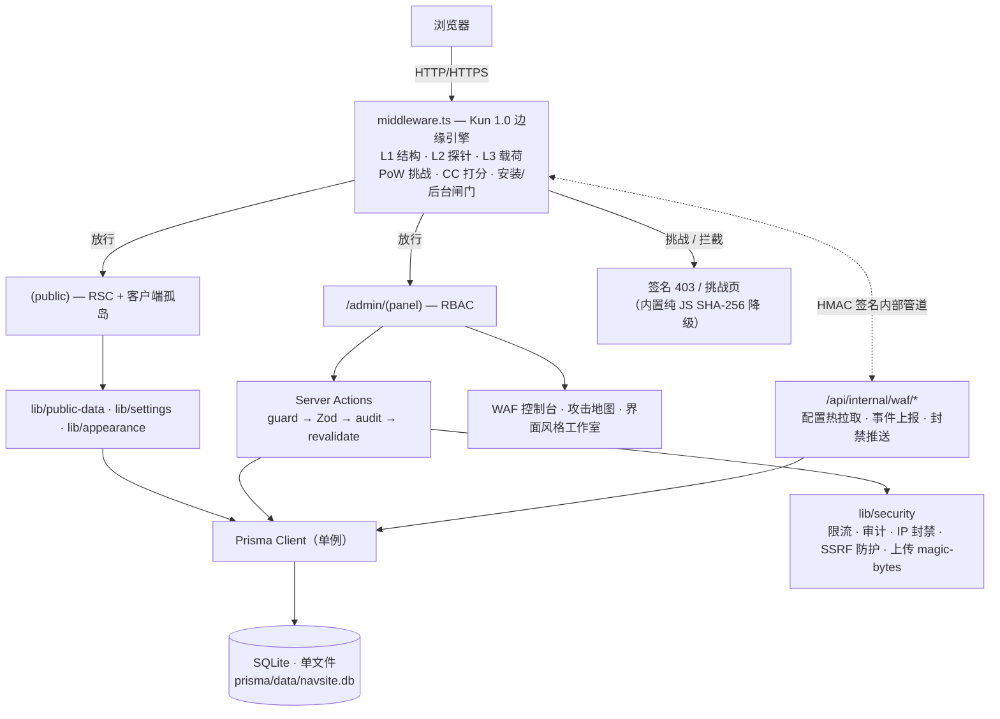

<p align="center">
  
</p>

<p align="center">
  <a href="#"></a>
  <a href="./LICENSE"></a>
  <a href="./package.json"></a>
  <a href="#十四参与贡献"></a>
  
  
  
</p>

<p align="center">
  <a href="./README.md">English</a> · <b>简体中文</b>
</p>

<p align="center">
  <a href="./docs/screenshots/demo.gif"></a>
</p>
<p align="center">
  <sub><b>Kun 1.0 边缘安全引擎</b> —— 实时点阵攻击地图 + 攻击弧线 · <b>iOS 风格液态玻璃</b>分类胶囊（Chromium 真折射）</sub>
</p>

> **HiTo** 是一个自托管的工具/资源导航站：精致的公开前台 + 完整的后台管理 + 首次部署安装向导 + **一个真正跑在边缘中间件里的 WAF 和实时全球攻击地图**。**克隆仓库后无需改任何一行代码即可上线** —— SQLite 内置于应用，没有数据库服务器要装：首访自动进入四步向导，建一个管理员，站点即可用。可以理解为「自托管、数据自己掌控」版的 Linktree / 起始页导航站 —— 别的项目在 README 里承诺的安全能力，HiTo 直接跑在 `middleware.ts` 里。

---

<p align="center">
  <a href="./docs/screenshots/liquid-glass.gif"></a>
</p>
<p align="center">
  <sub><b>液态玻璃胶囊</b> —— 来回切换原速实录（逐帧捕获弹簧飞行）</sub>
</p>

## 📖 目录

- [一、这是什么](#一这是什么)
- [二、核心特性](#二核心特性)
- [三、界面截图](#三界面截图)
- [四、技术栈](#四技术栈)
- [五、系统架构](#五系统架构)
- [六、快速开始(3 条命令)](#六快速开始3-条命令)
- [七、详细安装教程](#七详细安装教程)
  - [7.1 前置要求](#71-前置要求)
  - [7.2 准备数据库——没什么可准备的](#72-准备数据库没什么可准备的)
  - [7.3 安装依赖并启动](#73-安装依赖并启动)
  - [7.4 走完安装向导(四步)](#74-走完安装向导四步)
  - [7.5 生产部署](#75-生产部署)
  - [7.6 国内服务器 / 出网受限环境](#76-国内服务器--出网受限环境)
- [八、环境变量](#八环境变量)
- [九、常见问题与踩坑](#九常见问题与踩坑)
- [十、项目结构](#十项目结构)
- [十一、脚本命令](#十一脚本命令)
- [十二、生产安全 Checklist](#十二生产安全-checklist)
- [十三、Roadmap](#十三roadmap)
- [十四、参与贡献](#十四参与贡献)
- [十五、许可证](#十五许可证)
- [更新日志](#-更新日志)

---

## 一、这是什么

**HiTo** 帮你把一批分散的链接、工具、资源，整理成一个**可搜索、可分类、可统计**的公开导航页，并配一套完整的后台去维护它。

它和市面上同类东西的根本区别在于：

- **零外部依赖。** 数据库是应用自己管理的单个 SQLite 文件 —— 不用装 MySQL、不用买云数据库、不用手写连接串。备份整站 = 复制**一个文件**。
- **部署不用改代码。** 首访自动进 `/setup`：环境自检、数据库探测 + 迁移、创建管理员、可选导入示例数据，四步点完就能用。`.env` 由向导自动写入。
- **安全引擎是真的，不是卖点文案。** **Kun 1.0** 在边缘中间件里逐请求运行：结构校验、探针路径与载荷扫描（SQLi / XSS / 穿越 / 双重编码）、攻击期间的 PoW 浏览器验证、逐 IP 打分与升级式封禁、HMAC 签名的内部遥测 —— 后台把它全部渲染成**带攻击弧线的实时点阵全球攻击地图**。
- **外观也是你的。** 后台「界面风格」工作室直接改公开站的主题色、圆角、首屏风格与默认深浅色（带实时预览），整站即时换肤。不用碰一行 CSS。

### 适合谁

- 想搭一个团队/组织内部工具导航、书签墙、资源门户的开发者；
- 想要一个「比 Linktree 更可控、比 Notion 公开页更专业」的个人导航站；
- 想要一个开箱即用、又能安全交付给非技术同事日常维护的自托管项目 —— **而且扛得住公网**。

### 解决什么问题

| 痛点 | HiTo 的做法 |
|---|---|
| 自托管要装数据库、手改文件、手跑迁移 | SQLite 内置，首访自动进四步向导 |
| WAF / Cloudflare 要花钱或根本用不了 | Kun 边缘引擎随应用运行：探针/载荷扫描、PoW 挑战、限流封禁 |
| 不知道谁在攻击你 | 后台实时全球攻击地图 + 攻击流 + 国家排行 |
| 数据被 SaaS 绑架 | 一个你自己的 SQLite 文件；JSON/CSV 导出 + 快照备份内置 |
| 内容维护要懂技术 | 后台可视化 CRUD + 拖拽 + 批量 + ⌘K 命令面板 |
| 换主题要改 CSS | 界面风格工作室：颜色 / 圆角 / 首屏，实时预览 |

---

## 二、核心特性

- 🧭 **公开前台** —— 极光首屏（渐变光斑动画，亦可选网格/极简风格）、玻璃搜索框（`/` 键聚焦）、实时统计条、液态玻璃分类胶囊（Chromium 真折射、Safari/Firefox 拟真降级，三层渲染档位）、实时搜索（300ms 防抖 + 关键词高亮）、响应式卡片网格（1→5 列自适应）、带焦点陷阱的详情 Modal、最新 / 推荐 / A–Z 排序、点击统计、复制链接、底部社交图标（X / Instagram / GitHub / 微信 / 微博 / B站 等）、公告横幅（四色、可定时、可关闭）、SEO 输出（sitemap.xml / robots.txt / JSON-LD），全站遵守 `prefers-reduced-motion`。
- 🪄 **首次部署安装向导** —— 四步状态机（环境自检 → 数据库 → 管理员 → 示例数据），自动写入 `.env`、执行迁移、创建首个管理员。**无需手动改文件、无需手动跑 seed**，中断后可断点续装，完成后永久锁定。
- 🛡️ **Kun 1.0 边缘安全引擎** —— 每个请求都过 `middleware.ts`：
  - **L1** 结构校验（方法白名单、URL 长度、控制字符）
  - **L2** 探针路径检测（`/.env`、`/.git`、`/wp-admin`、`/phpmyadmin`、备份文件… 每条规则可单独开关）
  - **L3** 载荷扫描（SQLi / XSS / 路径穿越）—— 对每个 URL 的**原始、单次解码、双重解码**三种形态都扫
  - **PoW 防御验证** —— QPS 飙升或手动开启防攻击模式时，浏览器必须先完成 SHA-256 工作量证明（内置纯 JS 哈希降级，纯 HTTP 局域网也能用）；通过后签发带 TTL 的令牌
  - **CC 防护** —— 逐 IP 滑动窗口 + 递进式临时封禁，实时推送到后台
  - **全球攻击地图** —— Natural Earth 精确点阵世界地图，攻击弧线从来源飞向你的服务器，按动作着色，实时攻击流 + 国家排行 + 自动刷新
  - 引擎模式 `off / log / block` 后台热切换（≤10 秒），另有手动「防攻击模式」按钮
- 🛠️ **后台管理** —— Dashboard（近 30 天点击趋势，**原生 SVG 手绘、无图表库**）、分类与卡片 CRUD、拖拽排序、批量操作、URL 元数据一键抓取、死链检测、可恢复回收站、JSON/CSV 导入（dry-run 预览）与导出、快照备份、云盘 / URL 直链导入、多管理员 RBAC（ADMIN / EDITOR）、公告管理（定时上下线 / 优先级 / 行内启停）、站点设置（含 SEO 标签页：标题模板 / robots.txt 编辑 / noindex / 站长验证）、**⌘K 命令面板**（全局搜索 + 拼音别名 + 最近使用，懒加载）。
- 🎨 **界面风格工作室** —— 8 套精选主题色 + 自定义拾色器、四档圆角、三种首屏风格、访客默认深浅色，全部带实时缩略预览；保存值经 zod 校验（防注入）后以 CSS 变量注入，前台下一个请求即生效。
- 💰 **广告与验证** —— 广告位（头部 / 底部 / 内联 / 侧边 / 弹窗）、四种类型（脚本 / HTML / 图片 / iframe）、权重与设备定向、`ads.txt` 由数据库实时输出、按广告商配置站点验证（Meta 标签 / 验证文件 / DNS 备案）。
- 🌍 **7 种语言** —— 简体中文 / English / 日本語 / 한국어 / Español / Français / Deutsch，首访按 `Accept-Language` **在服务端**协商（无闪烁）。全站无硬编码文案。
- 🧱 **端到端类型安全** —— TypeScript `strict` + `noUncheckedIndexedAccess`，`no-explicit-any` 升级为 error，零警告 lint 预算。

---

## 三、界面截图

| 公开首页 | 安装向导 | WAF 控制台 · 攻击地图 |
|:---:|:---:|:---:|
|  |  |  |

| 界面风格工作室 | 后台概览 |
|:---:|:---:|
|  |  |

<p align="center"><sub>以上截图全部来自真实运行的实例（演示数据）。部署后可自行截屏放入 <code>docs/screenshots/</code> 替换。</sub></p>

---

## 四、技术栈

| 层 | 选型 | 版本 |
|---|---|---|
| 框架 | Next.js（App Router、RSC + Server Actions、edge middleware） | 15.3.3 |
| 语言 | TypeScript（`strict`、`noUncheckedIndexedAccess`） | 5.8.3 |
| UI 运行时 | React / React DOM | 19.1.0 |
| 样式 | Tailwind CSS + tailwindcss-animate | 3.4.17 |
| 组件 | Radix UI（13 包）+ shadcn 模式 | — |
| 动效 | Framer Motion | 11.15.0 |
| 国际化 | next-intl | 3.26.3 |
| ORM | Prisma + @prisma/client | 6.8.2 |
| 数据库 | SQLite（单文件，`connection_limit=1` 单写者模型） | 内置 |
| 校验 / 表单 | Zod + react-hook-form | 3.24.1 / 7.54.2 |
| 鉴权 | jose（JWT）+ bcryptjs | 5.9.6 / 2.4.3 |
| 拖拽 / 命令面板 / 缓存 | @hello-pangea/dnd / cmdk / lru-cache | 18.0.1 / 1.0.4 / 11.0.2 |
| 运行时 | Node ≥ 20.9，pnpm 9.15.4 | — |

---

## 五、系统架构



**一个请求的完整旅程：** `i18n/request.ts` 在服务端按 `Accept-Language` 协商语言（无闪烁）→ `middleware.ts` 里的 Kun 引擎检查请求（持有有效挑战令牌则跳过全部扫描）→ 安装闸门通过环回自检确认安装状态，`/admin` 做 Cookie 粗检 → 页面作为 RSC 渲染，经 Prisma 单例取数（前台只能看到 `published` 且未删除的行）→ 外观设置以 CSS 变量形式随 CSP nonce 注入 `<head>` → 任何写操作走 Server Action：守卫 + 限流 → Zod 校验 → 审计日志 → `revalidatePath`。引擎拦截或挑战的同时，会把事件（HMAC 签名、节流）写入 `waf_events` 表喂给攻击地图 —— 而真正的鉴权结论落在数据库 `Session` 行上，**强制下线立即生效**。

---

## 六、快速开始(3 条命令)

> 前置：**Node ≥ 20.9** 和 **pnpm 9**。不需要数据库服务器 —— SQLite 内置在应用里。

```bash
pnpm install               # postinstall 自动执行 prisma generate
pnpm dev                   # 启动，然后打开 http://localhost:3000
```

打开 <http://localhost:3000> —— 自动跳转 `/setup`。走完四步向导（默认值已指向内置 SQLite 文件），可选导入示例数据，站点即上线。**不改任何文件，不装任何东西。**

生产部署一条命令（构建自包含镜像，自带 nginx 入口与健康检查）：

```bash
AUTH_SECRET=$(openssl rand -base64 48) ANALYTICS_SALT=$(openssl rand -base64 16) \
PUBLIC_URL=http://你的服务器IP docker compose -f docker-compose.prod.yml up -d
```

---

## 七、详细安装教程

> 下面每一步末尾都有 **✅ 验证** 环节 —— 确认通过再继续。

### 7.1 前置要求

| 工具 | 版本 | 检查命令 |
|---|---|---|
| Node.js | ≥ 20.9（推荐 20 / 22 LTS） | `node -v` |
| pnpm | 9.15.4 | `pnpm -v` |

还没装 pnpm：

```bash
# 方式一：corepack（Node 自带）
corepack enable
# 方式二：npm 全局安装
npm i -g pnpm@9.15.4
```

> ✅ **验证：** `node -v` 输出 **v20.9 及以上**，`pnpm -v` 输出 **9.x**。

### 7.2 准备数据库——没什么可准备的

HiTo 使用 **SQLite**：数据库就是 `prisma/data/navsite.db` 这一个文件，由安装向导自动创建并迁移。没有服务器要装、没有用户要建、不用担心字符集（SQLite 原生 UTF-8，emoji 和中文直接可用）。

- 备份 = 复制这一个文件（用了上传功能就加上 `public/uploads/`），或用后台「数据 → 快照备份」/ JSON 导出。
- 搬家 = 复制文件。完事。
- 以后数据量大了？Roadmap 已列：把 Prisma datasource 换成 Postgres/MySQL，schema 与应用代码无需改动。

> ✅ **验证：** `prisma/data/` 目录存在（向导首跑自动创建）。

### 7.3 安装依赖并启动

```bash
pnpm install     # postinstall 自动执行 prisma generate
pnpm dev         # 开发模式；生产模式用 `pnpm build && pnpm start`
```

> ✅ **验证：** `pnpm install` 无红色报错，目录 **`node_modules/.prisma/client`** 存在。`pnpm dev` 后终端出现 **`▲ Next.js 15.3.3`** 与 **`Ready in …`**。

### 7.4 走完安装向导(四步)

浏览器打开 `http://localhost:3000` —— 自动跳转 `/setup`：

1. **环境自检** —— Node 版本、`.env` 与上传目录写权限、必需变量（缺失的如 `AUTH_SECRET` 由向导自动生成）。**你应该看到** 全绿勾选，「下一步」点亮。
2. **数据库** —— 内置 SQLite 文件，已预填。点 **「测试连接」**：**你应该看到** 文件探测通过；再点 **「执行迁移」** 运行 `prisma migrate deploy` 并提示成功。
3. **创建管理员** —— 用户名 + 邮箱 + 密码（**≥ 10 位，含大小写字母和数字**，bcrypt cost 12 存储）。**你应该看到** 表单提交后进入第 4 步。
4. **初始化数据** —— 可选导入 9 个分类、39 张示例卡片（幂等）。**你应该看到** 「安装完成」页。

之后 `/setup` 会**永久 302 跳转到首页**，防止重装劫持。全程不需要手动改任何文件。

> ✅ **整体验证：** 再访问 `/setup` —— 被跳转回首页，首页能渲染内容。`curl -s http://127.0.0.1:3000/api/health` 返回 **`"connected":true`**。

> 💡 **断点续装**：任何一步刷新或关闭浏览器，再次进入会从实际进度对应的步骤继续，不会从头来。

### 7.5 生产部署

**方式 A —— 自带 Docker Compose（推荐，已含 nginx 入口）：**

```bash
# 1) 在 docker-compose.prod.yml 同目录创建 .env，写入：
#      AUTH_SECRET=<openssl rand -base64 48>
#      ANALYTICS_SALT=<openssl rand -base64 16>
#      PUBLIC_URL=http://你的服务器IP
# 2)
docker compose -f docker-compose.prod.yml up -d
```

它会启动应用容器（standalone 产物，entrypoint 自动执行 `prisma migrate deploy`）和 80 端口的 nginx 边缘，并预置 `TRUST_PROXY=true` —— 限流 / IP 封禁 / 攻击地图看到的都是真实客户端 IP。SQLite 在命名卷 `app-data` 里，上传在 `uploads` 卷 —— 备份这两个卷就是备份全部。

> ✅ **验证：** `docker compose -f docker-compose.prod.yml ps` 显示 app **healthy**；`curl -I http://服务器IP` 返回 **200**（首跑为 **302 → /setup**）。

**方式 B —— 裸 Node + pm2 + 自备 nginx：**

```bash
pnpm install && pnpm build
pnpm i -g pm2
pm2 start pnpm --name hito -- start
pm2 save && pm2 startup
```

```nginx
location / {
    proxy_pass http://127.0.0.1:3000;
    proxy_http_version 1.1;
    proxy_set_header Upgrade $http_upgrade;
    proxy_set_header Connection "upgrade";
    proxy_set_header Host $host;
    # 下面两行必须加：Kun 的 IP 打分、封禁、审计日志都依赖真实客户端 IP
    # （同时在 .env 里设置 TRUST_PROXY=true）
    proxy_set_header X-Forwarded-For $proxy_add_x_forwarded_for;
    proxy_set_header X-Real-IP $remote_addr;
    proxy_set_header X-Forwarded-Proto $scheme;
    proxy_cache_bypass $http_upgrade;
}
```

> ✅ **验证：** `pm2 list` 显示 **`hito`** 为 **`online`**，`curl -I http://127.0.0.1:3000` 返回 **200**。反代后确认 `TRUST_PROXY=true` 已设置，后台攻击地图显示的是真实访客 IP。

**安全引擎上线调参：** 先用 `SECURITY_ENGINE_MODE=log` 跑一天，在 WAF 控制台确认无误拦后切 `block`（热生效 ≤10 秒，无需重启）。再设置 `WAF_SERVER_GEO="经度,纬度"`，让攻击地图的弧线指向你服务器的真实位置。

### 7.6 国内服务器 / 出网受限环境

出网慢或受限时，在 `pnpm install` **之前**把 npm 与 Prisma 引擎指向镜像源：

```bash
npm config set registry https://registry.npmmirror.com
export PRISMA_ENGINES_MIRROR=https://registry.npmmirror.com/-/binary/prisma
pnpm install
```

> ✅ **验证：** `pnpm install` 无网络错误完成。

---

## 八、环境变量

所有变量都在项目根目录 `.env`。复制 `.env.example` 即可；大部分由向导自动写入，也可手工配置。

| 变量 | 说明 | 默认 | 必填 |
|---|---|---|:---:|
| `DATABASE_URL` | SQLite 连接串（`file:./data/navsite.db?connection_limit=1`） | 向导写入 | ✅ |
| `AUTH_SECRET` | JWT + Kun HMAC 签名密钥，≥ 32 位随机串 | 向导自动生成 | ✅ |
| `AUTH_ACCESS_TTL` | 访问令牌有效期（秒） | `900` | — |
| `AUTH_REFRESH_TTL` | 刷新令牌有效期（秒） | `1209600` | — |
| `NEXT_PUBLIC_APP_URL` | 站点公开地址 | `http://localhost:3000` | — |
| `ANALYTICS_SALT` | 点击统计的 IP 哈希盐 | 向导自动生成 | — |
| `RATE_LIMIT_DRIVER` | `memory`（单实例）或 `db`（SQLite 计数，多实例安全） | `db` | — |
| `TRUST_PROXY` | 仅当反代会覆写 `X-Forwarded-For` 时设 `true` | `false` | — |
| `UPLOAD_DIR` | 上传目录（必须在 `public/` 内） | `./public/uploads` | — |
| `BACKUP_DIR` | 快照目录（禁止放在 `public/` 内） | `./data/backups` | — |
| `INTERNAL_ORIGIN` | 中间件自检用的环回地址 | `http://127.0.0.1:3000` | — |
| `SECURITY_ENGINE_MODE` | Kun 引擎模式：`off` / `log` / `block` | `log` | — |
| `UNDER_ATTACK_QPS` | 自动触发 PoW 模式的全局 QPS 阈值 | `600` | — |
| `CHALLENGE_TTL` | PoW 令牌 / 挑战有效期（秒） | `600` | — |
| `WAF_SERVER_GEO` | `"经度,纬度"` —— 攻击地图弧线的终点（你的服务器位置） | 北京 | — |

---

## 九、常见问题与踩坑

> 按**症状**组织，直接 Ctrl-F 你遇到的报错。以下全是真实踩过的坑。

<details>
<summary><b>1. <code>localStorage.getItem is not a function</code> —— 开发模式全部页面 500</b></summary>

**症状：** `pnpm dev` 后所有页面 500，日志刷 `localStorage.getItem is not a function`。
**原因：** Node ≥ 25 默认暴露实验性 Web Storage 全局；Next 的 dev 面板探测到后直接调用 `getItem`，而没配存储文件时会抛错。
**解决：** 已开箱处理 —— `pnpm dev` 经 `scripts/dev.mjs` 启动，检测到该全局时自动追加 `--localstorage-file`。Node 20/22 LTS 不受影响，生产构建不含该面板。
</details>

<details>
<summary><b>2. <code>ERR_TOO_MANY_REDIRECTS</code> —— 装完就重定向死循环</b></summary>

**症状：** 向导完成后访问首页死循环，浏览器提示「重定向次数过多」。
**原因：** 中间件通过 `fetch` 自检安装状态；若目标是**公网域名**，出网受限的服务器连不上自己的域名，误判「未安装」，于是 `/` ⇄ `/setup` 死循环。
**解决：** 自检走**环回** `INTERNAL_ORIGIN`（默认 `http://127.0.0.1:3000`），不需要 DNS / TLS / 出网。只有应用监听非默认端口时才需要覆盖。
</details>

<details>
<summary><b>3. Windows：<code>next build</code> 报 <code>EPERM … symlink … .next/standalone</code></b></summary>

**症状：** 编译成功，但复制 traced 文件时报 `EPERM: operation not permitted, symlink`。
**原因：** 面向 Docker 的 `standalone` 输出需要 symlink 特权，Windows 默认账户没有。
**解决：** standalone 输出为**显式开启**（`NEXT_OUTPUT=standalone`，Dockerfile 内已设置）。本地 Windows 用默认输出 + `next start`，什么都不用做。
</details>

<details>
<summary><b>4. 生产构建报：<code>[rate-limit] RATE_LIMIT_DRIVER=memory in production</code></b></summary>

**症状：** `pnpm build` 在收集页面数据阶段中止，报限流守卫错误。
**原因：** 有意为之的守卫 —— 内存限流器无法跨副本协调，生产构建拒绝 `memory` 模式。
**解决：** 保持 `RATE_LIMIT_DRIVER="db"`（`.env.example` 默认值；计数存在 SQLite 表里，单实例/多实例都安全）。
</details>

<details>
<summary><b>5. 引擎把我自己拦了 —— 测试攻击后所有请求 403</b></summary>

**症状：** 在 WAF 控制台玩攻击测试后，自己的 IP 开始收到 403/429 页面。
**原因：** Kun 正常工作 —— 重复恶意请求累积 strike，触发递进式临时封禁（内存态，自动过期）。
**解决：** 等封禁过期，或在 **安全中心 → 封禁管理** 里解除自己的 IP。安全起见测试时用 `log` 模式，规则确认无误拦后再切 `block`。
</details>

<details>
<summary><b>6. 验证页提示「验证失败」或无限循环</b></summary>

**症状：** 防攻击模式下浏览器停在 PoW 页，永远过不去。
**原因 / 解决：** (a) 浏览器禁用了 JavaScript —— 挑战必须 JS；(b) 过老的浏览器没有 `TextEncoder` —— 升级；(c) 挑战与提交之间 `AUTH_SECRET` 变了（Cookie 失效）—— 强制刷新。页面内置**纯 JS SHA-256 降级**，纯 HTTP 局域网（`http://192.168.x.x`）正常可用 —— 不依赖 `crypto.subtle`。
</details>

<details>
<summary><b>7. <code>pnpm install</code> / <code>prisma generate</code> 卡住或超时</b></summary>

**症状：** 装依赖长时间无进度，或 `prisma generate` 卡在下载引擎。
**解决：** 安装前指向镜像源：
```bash
npm config set registry https://registry.npmmirror.com
export PRISMA_ENGINES_MIRROR=https://registry.npmmirror.com/-/binary/prisma
pnpm install
```
</details>

<details>
<summary><b>8. Windows：项目文件夹改名/移动后全崩</b></summary>

**症状：** 改了文件夹名后，`tsc` / `next` 报 "Cannot find module"，但包明明在 `node_modules` 里。
**原因：** pnpm 的 `node_modules` 全是指向绝对 `.pnpm` 路径的 junction，改名后全部悬空。
**解决：** 删掉 `node_modules` 重新 `pnpm install`（lockfile 保证结果一致）。
</details>

<details>
<summary><b>9. Prisma <code>P3005</code> —— 迁移时报「数据库 schema 非空」</b></summary>

**症状：** `pnpm db:deploy` 对已有数据库报 P3005。
**原因：** 数据库不是由迁移历史创建的（比如从别的机器拷过来的）。
**解决：** 做一次基线：
```bash
pnpm exec prisma migrate resolve --applied 20260826063936_init
pnpm exec prisma migrate resolve --applied 20260826070000_add_waf_events
```
</details>

<details>
<summary><b>10. 并发写入时报 <code>SQLITE_BUSY</code></b></summary>

**症状：** 多管理员同时写入时偶发 `SQLITE_BUSY: database is locked`。
**原因：** SQLite 是单写者数据库，并发写事务会排队。
**解决：** 默认连接串自带 `connection_limit=1`，已将写入串行化避免此错。如果手改过 `DATABASE_URL`，改回去即可。重多管理员写入场景请等 Roadmap 的 Postgres 选项。
</details>

---

## 十、项目结构

```
hito/
├─ docker/                        # entrypoint(启动自动迁移)· nginx 入口配置
├─ docker-compose.prod.yml        # app(standalone)+ nginx 边缘 + 数据卷
├─ scripts/dev.mjs                # dev 启动包装器(Node ≥25 Web Storage 兼容)
├─ prisma/
│  ├─ schema.prisma               # 17 个模型 · SQLite datasource
│  ├─ migrations/                 # 已提交；向导执行 migrate deploy
│  └─ seed.ts                     # 幂等示例数据
├─ messages/                      # 7 个语言文件，键完全一致
├─ assets/                        # banner.svg · icon svg
└─ src/
   ├─ middleware.ts               # Kun 1.0 边缘引擎 · 安装闸门 · /admin 闸门 · CSP/HSTS
   ├─ i18n/                       # 服务端 Accept-Language 协商
   ├─ app/
   │  ├─ (public)/                # 首页、loading、错误边界
   │  ├─ setup/                   # 安装向导
   │  ├─ admin/(panel)/           # dashboard / cards / categories / trash / data / announcements
   │  │                           # / ads(+verifications) / users / settings / appearance / security
   │  ├─ [verify]/                # 广告平台验证文件(存于 DB)
   │  ├─ ads.txt/ · robots.txt/ · sitemap.ts
   │  └─ api/                     # health, setup/*, track/click, auth/refresh, upload,
   │                              # admin/command-search, internal/waf/*(HMAC)
   ├─ components/
   │  ├─ admin/                   # 各管理器 · waf-console · world-attack-map · appearance-manager
   │  ├─ public/                  # home-view · card-item · liquid-glass-pill · 广告 · 公告
   │  └─ ui/                      # shadcn 风格基础组件
   └─ lib/
      ├─ security/                # 限流 · 审计 · IP · 上传 · geoip · 安全头
      │  └─ engine/               # Kun:engine · scanner · rules · challenge(PoW) · page · internal-client
      ├─ waf/                     # 运行时配置 · 事件仓库 · 后台锁定
      ├─ auth/                    # jwt · session · cookies · login-lock · password
      ├─ actions/                 # server actions(guard → zod → audit → revalidate)
      ├─ appearance.ts            # 后台自定义主题(CSS 变量注入)
      └─ liquid-glass/            # 三档玻璃胶囊渲染器
```

---

## 十一、脚本命令

| 命令 | 作用 |
|---|---|
| `pnpm dev` | 开发服务器（含 Node ≥25 Web Storage 兼容包装） |
| `pnpm build` / `pnpm start` | 生产构建 / 启动 |
| `pnpm typecheck` | `tsc --noEmit` 严格类型检查 |
| `pnpm lint` | ESLint（零警告预算） |
| `pnpm db:generate` | 重新生成 Prisma Client |
| `pnpm db:deploy` | 应用已有迁移（生产 / 向导内使用） |
| `pnpm db:migrate` | 开发期创建迁移 |
| `pnpm db:seed` | 幂等示例数据（重复执行不产生重复数据） |
| `pnpm db:studio` | 打开 Prisma Studio |

---

## 十二、生产安全 Checklist

- [ ] 全站 HTTPS；确认响应带 `Strict-Transport-Security` 与基于 nonce 的 CSP（生产由中间件输出）
- [ ] `AUTH_SECRET` 为 ≥ 48 字节随机值、专用不复用；泄露后轮换（会使所有会话与 Kun 令牌失效）
- [ ] 反代环境：`TRUST_PROXY=true` 且正确转发 `X-Forwarded-For` —— 否则 IP 打分、封禁、限流、攻击地图记录的全是代理 IP
- [ ] 只允许**一层**可信代理覆写 `X-Forwarded-For`（取最右跳的归因假设）；多层代理时由最外层统一覆写
- [ ] 引擎先以 `log` 模式跑一天确认无误拦，再在后台切 `block`（无需重启）
- [ ] 设置 `WAF_SERVER_GEO`，让攻击地图弧线指向真实服务器位置
- [ ] 安装完成后访问 `/setup` 被 302；`/api/internal/waf/*` 对无 HMAC 签名请求一律 401
- [ ] 未登录访问 `/admin/*` 被跳转；EDITOR 访问管理员专属页面得到 403
- [ ] `public/uploads/` 禁止脚本执行；上传经 magic-bytes 实测校验
- [ ] 多实例：`RATE_LIMIT_DRIVER=db` + 共享 SQLite 卷 —— 或等 Roadmap 的 Postgres 选项
- [ ] 定期异地备份（后台 JSON 导出 / 快照 / 直接拷贝 `prisma/data/navsite.db`）；定期 `pnpm audit`

---

## 十三、Roadmap

- [ ] **Postgres / MySQL datasource 选项** —— 大规模部署切换 Prisma provider（schema 不变）。
- [ ] **Redis 限流驱动** —— `RateLimiter` 的第三个后端，面向集群部署。
- [ ] **S3 / Cloudflare R2 存储** —— 上传文件脱离本地磁盘。
- [ ] **PoW 难度自适应** —— 攻击强度越大，哈希前缀越难。
- [ ] **可选 Turnstile/hCaptcha** —— 用托管挑战替换内置 PoW。
- [ ] **IP 信誉分** —— ASN/代理评分进攻击地图（需 `TRUST_PROXY=true`）。
- [ ] **多语言内容字段** —— 卡片/分类标题与描述可翻译。
- [ ] **Sentry 接入** —— 错误边界上报 `digest`。

---

## 十四、参与贡献

欢迎 PR。请保持两道绿灯：

```bash
pnpm typecheck   # 必须全绿
pnpm lint        # 零警告
```

新增用户可见文案必须同步写入 **全部 7 个** `messages/*.json` 且键一致。新的写操作一律遵循既有 Server-Action 模式（guard → Zod → audit → `revalidatePath`），并保持边缘中间件不引入 `node:*` / 数据库依赖（必须维持 edge-runtime 可运行）。

---

## 十五、许可证

[MIT](./LICENSE) © 2026 HiTo contributors.

---

## 📝 更新日志

### 2026-08-29 · 统计图表从未渲染过 + README 媒体

- **修复 —— 所有 SQLite 部署的 WAF 统计都是空的。** Prisma 在 SQLite 中把日期时间存为整数毫秒，而原始 SQL 却拿它和 `datetime('now', …)` 文本比较（INTEGER 恒小于 TEXT → 永远 0 行），分组用的 `strftime` 也直接作用于毫秒。近 7 日趋势、24h 分布、Top-IP、今日总量全部改为 unixepoch 整数窗口 + `strftime(..., at/1000, 'unixepoch', 'localtime')` 日期键。后台概览的 30 天点击趋势同款问题一并修复。
- **修复 —— 趋势柱条塌缩为 0 px。** 百分比高度解析在 auto 高度的 flex 父容器上；列容器改为持有确定高度。
- **新增 —— README 真实媒体**：顶部 21 秒 GIF（实时攻击地图弧线 + 液态玻璃胶囊弹簧动效，1.7 MB），以及首页 / 安装向导 / WAF 控制台 / 界面风格工作室 / 后台概览五张真实截图。

### 2026-08-29 · 安全审计修复轮：绕过封堵、限流模型修正

- **修复 —— K3 载荷扫描绕过。** 一个只有 JWT *形状*（无需有效签名）的 Cookie 就能让全部 L3 SQLi/XSS/穿越规则静默失效。扫描器现无条件作用于所有请求。实测：原 200 的绕过现已 403。
- **修复 —— 限流身份轮换。** 不带 Cookie 的客户端每请求都会被签发全新随机桶 ID（对丢 Cookie 的攻击工具限流形同虚设）。现回退到确定性的 `anon:<ip>` 共享桶 —— 限流生效；`TRUST_PROXY=true` 时恢复按 IP 隔离。
- **修复 —— 管理锁爆破。** 锁定页的密码校验新增独立失败锁（错 5 次 → 15 分钟），叠加在限流之上。
- **修复 —— 纯 HTTP 登录死循环。** 生产构建的鉴权 Cookie 一律 `Secure`，导致文档里的 `http://服务器IP` 部署永远登录不上。现按真实请求协议（`x-forwarded-proto`）推导 `Secure`。
- **修复 —— 「解封」死代码。** 后台解封只写库、引擎永远收不到（`banReleases` 硬编码空数组）。配置端点现按「恰好一次」消费解封指令并删除记录（不再无限累积）。端到端实测通过。
- **修复 —— 安装向导自锁。** 按文档全新部署时向导 API 全部 403。闸门默认放开（开箱即装），仅当显式配置 `SETUP_ALLOW_IPS` / `SETUP_TOKEN` 时才启用严格模式。
- **修复 —— 引擎模式被静默降级。** 全新数据库（无 `waf.mode` 行）会让配置端点返回默认 `log`，覆盖 `SECURITY_ENGINE_MODE=block`。现仅当管理员真正设置过模式时才下发。
- **修复 —— 其他。** `test-connection` 不再把候选 `DATABASE_URL` 泄漏进全局 Prisma 单例（`finally` 中复位）；登录 IP 级锁定仅在 IP 可归因时启用（杜绝 "direct" 键 DoS）；内部 API 拒绝**重放**签名、`AUTH_SECRET` 为空时整体 fail-closed；无 `Content-Length` 的 chunked 上传返回 411；`.gitignore` 补齐 `.env.*` 与 sqlite 变体；`install.sh` 写入安全限流驱动；7 语言包清除残留 MySQL 文案；数据库路径文档统一为 `prisma/data/navsite.db`。
- **回归：** 重建后 10/10 修复验证断言 + 10/10 攻击/流量矩阵全绿。

### 2026-08-29 · WAF 加固轮：PoW 可移植性、扫描器反混淆、i18n 修复

- **修复 —— 挑战页在纯 HTTP 下死循环。** PoW 页依赖 `crypto.subtle`，该 API 仅存在于安全上下文；经局域网 HTTP（`http://192.168.x.x`）访问时挑战永远无法通过。页面现内置**纯 JS SHA-256**（对 `node:crypto` 214/214 向量校验通过，含多字节 UTF-8 与块边界），`subtle` 缺失时自动降级。PoW 前缀不再硬编码 —— 由引擎下发 `ENGINE_DEFAULTS.POW_PREFIX` —— 且通过验证后回跳**原始深层链接**（`returnTo`，仅限站内路径 + 转义），不再固定跳首页。
- **修复 —— L3 扫描器绕过。** 边缘运行时的 `decodeURIComponent` 是宽松实现，「只解码一次」的扫描对双重编码载荷（`%2527…`）与部分混淆形态失明。`scanPayload`/`scanProbePath` 现同时扫描**原始 + 单次解码 + 双次解码**三种形态；探针规则新增 `/xmlrpc.php`、`/adminer`、`/solr/`、`/jenkins/`、`/manager/html`、`/telescope`、`.swp`、`.save`、`.sqlite`、`.sqlite3`、`.db`。
- **修复 —— i18n 富文本崩溃。** 27 条语言消息中的裸 `<head>`/`` 被 next-intl 解析为富文本标签（`UNCLOSED_TAG`），导致广告验证后台页面部分渲染失败。7 个语言包全部清理（全角括号）。
- **修复 —— 空 404。** 未知单段路径落在 `[verify]` 动态路由上返回无 body 的裸 404；现返回带样式的 404 页。404/403/挑战页统一带上署名。
- **验证：** 92 项断言的黑盒套件全绿 —— 27 向量渗透矩阵（全部拒绝）、完整 PoW 流程（挑战 → 解算 → 通过 → 深链 → 错误 nonce 仍拦截）、12/12 后台页面、压测零 5xx。

### 2026-08-28 · 设计系统 + 界面风格工作室 + 攻击地图

- **新增 —— 界面风格工作室**（`/admin/appearance`）：主题色预设 + 自定义拾色器、圆角档位、首屏风格（极光 / 网格 / 极简）、访客默认深浅色；以带 nonce 的 CSS 变量注入，zod 校验存储；实时缩略预览。
- **新增 —— 前台重设计**：极光首屏（纯 CSS transform/opacity，遵守 reduced-motion）、玻璃搜索框（`/` 聚焦）、统计条、渐变卡片占位、页脚发丝线 —— 既有功能（广告 / 公告 / 多语言 / Modal / 玻璃胶囊）全保留。
- **新增 —— 全球攻击地图 v2**：由 Natural Earth land-110m 栅格化的点阵世界（14 个已知坐标探针校验通过），攻击弧线飞向可配置的服务器节点（`WAF_SERVER_GEO`），按动作着色，实时攻击流、国家排行、15 秒自动刷新。

### 2026-08-26 · 首次发布

- Kun 1.0 边缘引擎（L1/L2/L3 + PoW + CC + HMAC 内部管道）、基于内置 SQLite 的四步安装向导、完整后台管理、液态玻璃分类胶囊、7 语言服务端 i18n、SEO 工具箱、广告与站点验证、快照备份。

---

<div align="center">
  <sub>404 / 403 页面由 <b>VulnLab</b> 提供技术支持 · Built with Next.js 15 · 如果 HiTo 帮你省了一个周末，欢迎点个 ⭐。</sub>
</div>
